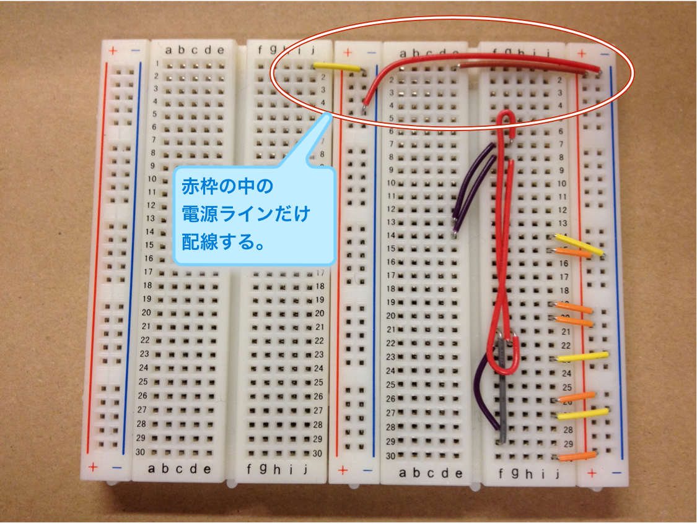
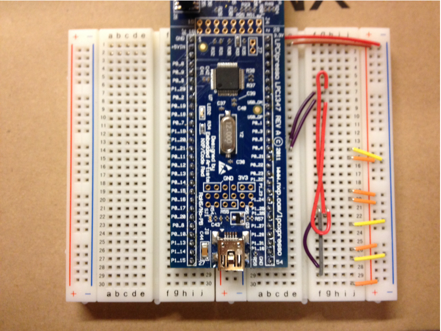

led1347-led-ticker
==================

LEDをチカチカさせるだけの単純なプログラムを作成します。よく「Lチカ」と呼ばれるプログラムです。

LEDの点滅をさせるだけのプログラムは組込CPUの基本的な機能と、最小限のツールセットの使用法を確認する為によく使われます。

LPC1347の`P0_1`という汎用I/Oピン(GPIOピン)にLEDを接続して点滅するプログラムを作成します。

## 電源ラインの配線

はじめに電源ラインだけ配線します。

配線するのは次の3本です。

- 左側の`j1`から中央のマイナス(-)
- 中央のマイナスから右側のマイナス(-)
- 右側の`e1`から右側のプラス(+)

## LPCxpresso評価ボードを刺す

評価ボードを左側は`i1`から`i27`まで、右側は`b1`から`b27`まで刺さるように刺します。

## LEDと抵抗を刺す

LEDの極性は長い方がプラス側です。今回の回路ではLPC1347ボード側の`e11`にプラスがきます。もう一方を`f11`に刺してください。

抵抗は`j11`とマイナス(グランド)に接続します。220Ωの抵抗なので赤赤茶色金というカラーコードがついています。

配線などに問題ないか良く確認してください。

## プロジェクトのひな形を作る

プロジェクトのひな形を作ります。

LPCxpresso IDEの右下のQuick Start ViewにあるNew Project...をクリックします。

- LPC13/LPC17/LPC18->LPC13xx(12bit ADC)->C Projectを選択して、Nextボタンを押します。
- Project Nameに適当なプロジェクト名を入れます。ここではlpc1347-led-tickerなどにします。Nextボタンを押します。
- 次の画面ではLPC1347が選択済みであることを確認して、Nextボタンを押します。
- ライブラリなどの設定は特に問題ないのでNextボタンを押します。
- C Dialectのドロップダウンリストからgnu99を選択してFinishを押します。

## LEDのポート番号、ピン番号を確認

LEDのポート番号は`0`番、ピン番号は`1`番になります。下記のページに修正点のコミットがあるので、これを参考に`src/main.c`を修正してコードを完成してください。

- [forループでタイミング調整するLチカの完成](https://github.com/yhojo/led1347-led-ticker/commit/b72a72692019c814da0627b632bd25c1569a1341)

## ボードでの動作・デバッグ

動作を確認してデバッグするために、USBケーブルでPCとボードを接続します。ボード側はNXP LPC-Linkとシルク印刷されている側のUSBコネクタにケーブルを接続してください。

USBケーブルでボードをPCに接続したら、IDEのProject Explorerで対象プロジェクト(`lpc1347-led-ticker`)を選択します。続いて、QuickstartのDebug 'lpc1347-led-ticker'を押してデバッグを開始します。

いくつかダイアログが出ますが、OKボタンを押して先に進めてください。コンパイル・ビルドが実行され、プログラムがLPC1347のFlash ROMに書き込まれてデバッガーが下記のポイントで停止します。

    LPC_SYSCON->SYSAHBCLKCTRL |= (1<<6);

## リファクタリング

さて、ここでいくつかの手順を関数に分離するなどしてコードを整理しましょう。また、IDEが生成した不要なコメントなども取り除きます。

- [不要なコメントを削除](https://github.com/yhojo/led1347-led-ticker/commit/d7dcdaf01afb62a80fde82214028e8d5bf8897d4)
- [GPIO操作を関数化してコードを整理](https://github.com/yhojo/led1347-led-ticker/commit/b6deb424f1b803bff3cadd291a753fd6fa7703de)

## Sys Tick割り込みで動作するようにする

先ほどのコードではLEDの点滅タイミングをforループで行っていました。しかし、この方法だとタイミングを厳密に制御することは難しい上に、コンパイラの最適化でforループ自体が撤去されてしまう恐れがあります。そこで、下記のコミットにある修正を行って割り込みによってタイミングを計るようにします。

ここでは500ms(ミリ秒)でLEDの点灯・消灯を制御するようにしています。

- [割り込みで0.5秒刻みで点灯・消灯を切り替えるよう修正](https://github.com/yhojo/led1347-led-ticker/commit/3d6d72860d77c51b5fc127599f615745612507d2)

これでLEDと点滅プログラムは完成です。

